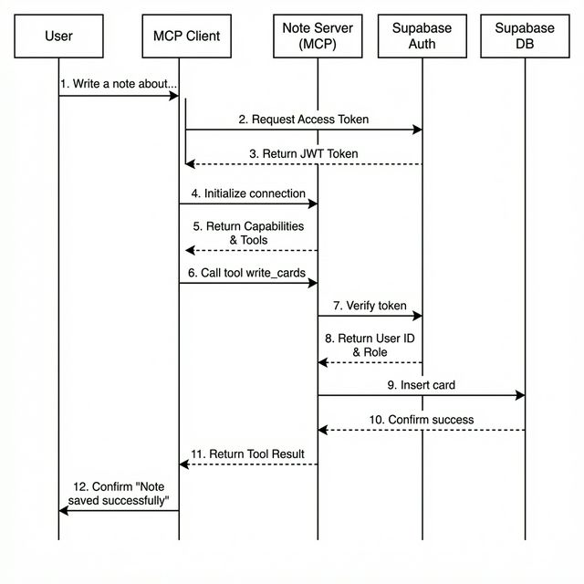

# Supascribe Notes MCP

A TypeScript MCP server that writes index cards to Supabase, deployed on Google Cloud Run.

## MCP Tools

| Tool          | Description                                           |
| ------------- | ----------------------------------------------------- |
| `health`      | Check server status and Supabase connectivity         |
| `write_cards` | Validate and upsert index cards with revision history |

## Architecture



## Prerequisites

- Node.js 22+
- Docker (for containerized deployment)
- Google Cloud CLI (`gcloud`) — for Cloud Run deployment
- A Supabase project with the schema applied

## Setup

```bash
# Install dependencies and git hooks
make install
```

### Environment Variables

| Variable                    | Required | Description                   |
| --------------------------- | -------- | ----------------------------- |
| `SUPABASE_URL`              | ✅       | Supabase project API URL      |
| `SUPABASE_SERVICE_ROLE_KEY` | ✅       | Supabase service role key     |
| `PORT`                      | ❌       | Server port (default: `8080`) |
| `PUBLIC_URL`                | ❌       | Public URL for OAuth config   |

## Authentication

This server supports **OAuth 2.0**. The server verifies standard Supabase Auth JWTs. It exposes OAuth metadata at `/.well-known/oauth-authorization-server` for MCP clients to discover.

## Database Schema

Apply migrations in order:

```bash
# Via Supabase CLI or dashboard SQL editor
psql < supabase/migrations/001_create_cards.sql
psql < supabase/migrations/002_create_card_revisions.sql
psql < supabase/migrations/003_create_generation_runs.sql
```

## Development

```bash
# Start dev server with hot reload
make dev

# Run tests
make test

# Run tests with coverage
make test-coverage

# Lint and format
make lint
make format

# Run all CI checks locally
make ai-checks
```

## Docker

```bash
# Build
docker build -t supascribe-notes-mcp .

# Run
docker run -p 8080:8080 --env-file .env supascribe-notes-mcp
```

## Deploy to Cloud Run

```bash
# Set your GCP project
gcloud config set project anchildress1-unstable

# Deploy
bash deploy.sh
```

## Smoke Tests

After deployment, verify the service is running:

```bash
SERVICE_URL="https://supascribe-notes-mcp-u36ut3r63a-ue.a.run.app"

# HTTP status check
curl "$SERVICE_URL/status"

# OAuth Discovery
curl "$SERVICE_URL/.well-known/oauth-authorization-server"

# Example: Write a card (Requires valid session)
# First, perform initialization as above inside an MCP client.
# Then, the client can call tools. Here is the JSON-RPC payload structure
# that would be sent to the /messages endpoint for the write_cards tool:
#
# POST /messages?sessionId=<session-id>
# {
#   "jsonrpc": "2.0",
#   "id": 2,
#   "method": "tools/call",
#   "params": {
#     "name": "write_cards",
#     "arguments": {
#       "cards": [
#         {
#           "title": "Quantum Entanglement",
#           "blurb": "Spooky action at a distance",
#           "fact": "Two particles remain connected even when separated by vast distances.",
#           "url": "https://en.wikipedia.org/wiki/Quantum_entanglement",
#           "category": "Physics",
#           "signal": 5,
#           "tags": { "lvl0": ["Science"], "lvl1": ["Quantum Physics"] },
#           "projects": ["research-2025"]
#         }
#       ]
#     }
#   }
# }
```

To fully test the MCP functionality, configure your MCP client (like Claude Desktop) to connect to the SSE endpoint:

- **URL**: `$SERVICE_URL/sse`
- **Auth**: Use the standard OAuth 2.1 flow supported by your client, pointing to your Supabase project's auth endpoints.

## Card Shape

```json
{
  "objectID": "uuid (auto-generated)",
  "title": "string (required)",
  "blurb": "string (required)",
  "fact": "string (required)",
  "url": "string (optional, must be valid URL)",
  "tags": { "lvl0": ["string"], "lvl1": ["string"] },
  "projects": ["string"],
  "category": "string (required)",
  "signal": "number 1–5 (required)",
  "created_at": "timestamptz (auto)",
  "updated_at": "timestamptz (auto)"
}
```

## CI/CD

- **GitHub Actions** — lint, test (80% coverage), secrets scan, build
- **Release Please** — conventional commit based semantic versioning
- **Commitlint + rai-lint** — enforces AI attribution footers
- **Lefthook** — git hooks for commit message validation

## License

PolyForm Shield 1.0.0
